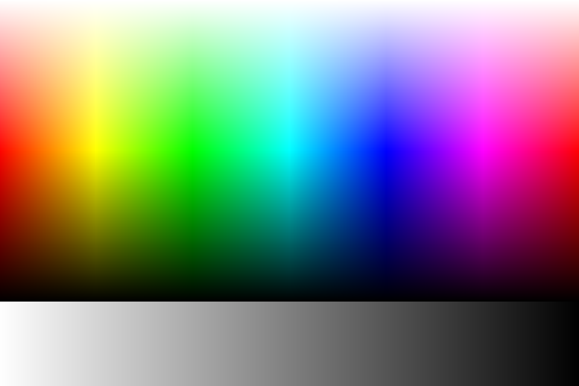
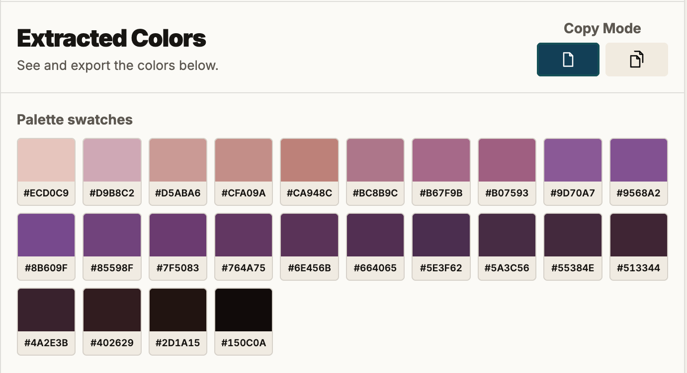
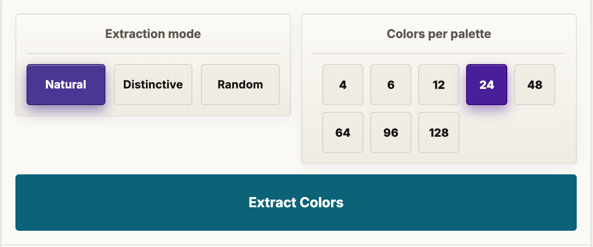
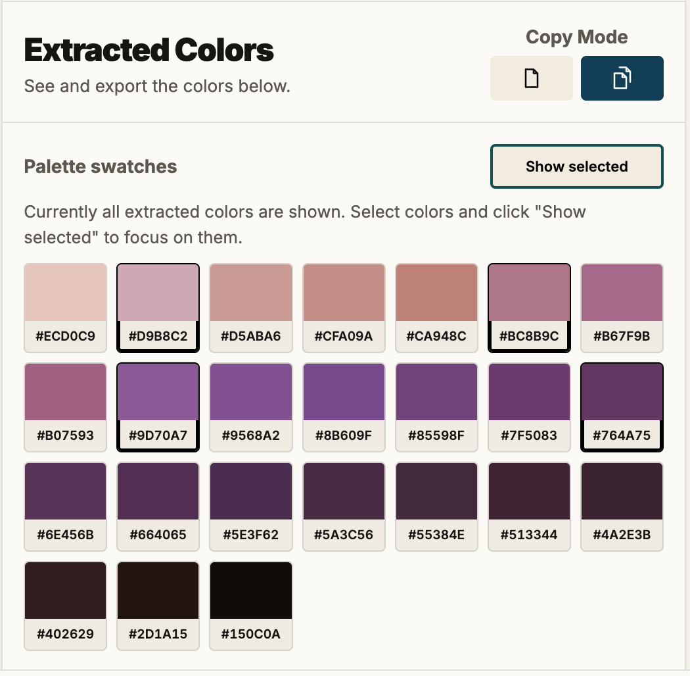
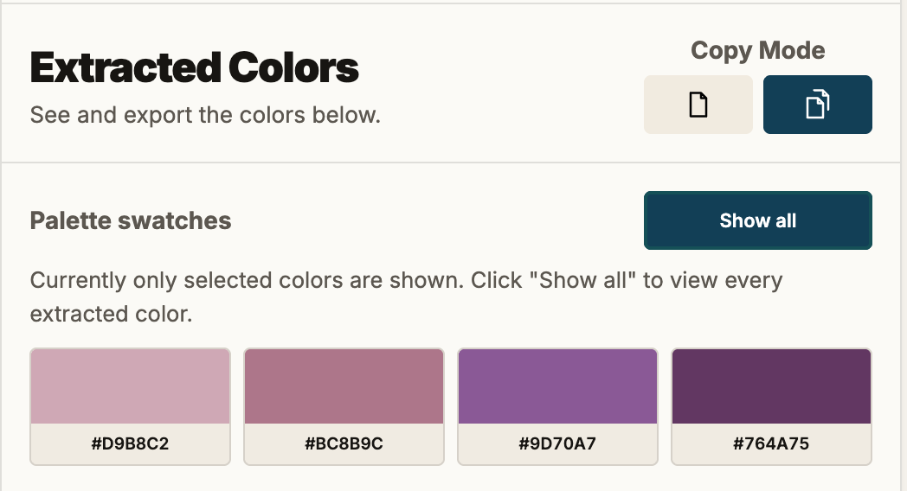
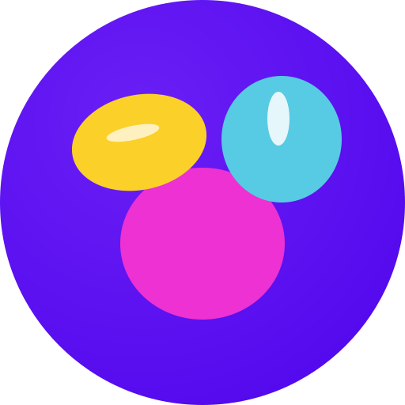

# Image2Colors Community Guide

Welcome, and thank you for stopping by. This page walks you through **[Image2Colors.com](https://www.image2colors.com)**, even if this is your very first visit. It only takes a few minutes.

## What Image2Colors does

**[Image2Colors.com](https://www.image2colors.com)** looks at an image and pulls the colors out of it. From there you can copy a single color or export the whole palette in the format you need.

That is where it starts, but not where it ends. The app keeps growing, and color extraction is only the first chapter.

We have more in mind. If you have an idea, a wish, or something that quietly annoyed you, we truly want to hear it. Open an issue at [github.com/nxpatterns/image2colors-community/issues/new](https://github.com/nxpatterns/image2colors-community/issues/new), or come say hello on Reddit at [reddit.com/r/image2colors](https://www.reddit.com/r/image2colors).

And if you know more about color than about building apps, even better. We would love to learn from you, and maybe build something together.

## How to start

There are two easy ways in. Bring your own image with the upload button , or use the demo image that already waits inside the app.

This is the demo image you begin with, a full sweep of hues fading through light and shadow, with a band of grays along the bottom. It is a friendly place to experiment before you reach for a photo of your own:

<p align="center">
  
</p>

Either way, you can start playing right away: paint over the areas you care about with the brush, then click **Extract Colors**.

You do not have to mark anything. If you want the colors of the whole picture, just click **Extract Colors** and the app reads the entire image for you.

## Select the important area or areas

**[Image2Colors.com](https://www.image2colors.com)** began with a simple wish: we wanted to catch the colors of nature. And nature, it turns out, is shy. Its best colors often hide in a small corner of the frame, and reading the whole image tends to wash them out. So we gave you a way to point at what matters. A butterfly resting on a flower. A bird half-hidden in a tree. A single car in a gray street. Mark it, and you get the colors you actually came for.

<p align="center">
  
</p>

<p align="center">
  
</p>

To make that easy, you have a few tools:

-  a **brush** to paint over the pixels you want
-  an **eraser** to take pixels back out
-  **undo** and  **redo**, for when your hand slips
-  **clear last** to drop only your most recent stroke, and  **clear all** to wipe the selection and start over

If you mark nothing, the app uses the whole image. Your upload if you brought one, and the demo image if you did not.

That is why, when you press **Extract Colors** without having painted anything, a small note slides in to let you know the whole image is going into the mix, every last pixel. It is not a warning, and it is not a mistake. Reading the entire picture is a perfectly good way to work. We only tap you on the shoulder to say the other door is open too: paint one or more areas, and from then on only the pixels inside them, and their colors, are counted.

## Choose how colors should be extracted

Here is a fair question: **why three modes at all?**

<p align="center">
  
</p>

Because "the colors of an image" is not one single truth. It depends on what you are looking for. So we gave you three lenses, and each one answers a different question.

**Natural** answers: **what does this image actually feel like?** It reads the whole range of light and shadow and hands the colors back in the proportion they really appear. If a photo is mostly soft greens with a little sky, that is what you get, soft greens with a little sky. This is the mode for mood boards, for painters, for anyone who wants the honest atmosphere of a scene instead of a tidied-up version of it.

**Distinctive** answers: **what are the truly different colors in here?** It pushes the results apart on purpose and drops the near-twins, so every swatch clearly earns its place. This is the one designers tend to reach for. When you need a palette where each color is its own decision, a base, an accent, a highlight that will not quietly collapse into its neighbor, start here.

**Random** answers: **what might I not have thought of?** It picks real pixels instead of smoothing everything into averages, and it gives you a slightly different take each time you run it. Run it, look, run it again. If you build UI frameworks or design systems and you want unexpected but usable starting points, this is your playground. Reroll until something surprises you.

None of them is more "correct" than the others. Send the same image through all three and you will feel the difference right away, and soon you will know which lens fits which job.

Then decide how many colors you want:

4, 6, 12, 24, 48, 64, 96, or 128.

Small numbers keep things tight, a handful of colors you could build a brand or a set of buttons around. Larger numbers open the image up into a full spectrum, closer to design tokens, gradients, or a sampling sheet you can pick from later.

There is no wrong choice here either. Fewer colors ask you to commit. More colors give you room to wander. And there is a reason the count matters to us: in later versions we want to generate palettes ready-made for frameworks like Angular Material (and others as well), which expect a certain number of colors and tokens. More on that soon.

## Generate and review your palette

Click **Extract Colors** and watch your swatches appear in the result panel. Nothing here is set in stone. Repaint a little, switch the mode, change the count, and extract again. Most palettes get better on the second or third try, once your eye tells you what was missing. Keep going until it feels right to you, not until it looks finished on paper.

## Copy and export your result

Once your palette is on screen, there are really two things you might want: to grab a single color in a hurry, or to carry the whole set away with you. The app keeps those two apart with a small mode switch, marked by a sheet-of-paper icon.

**Single copy**  is the default, the single-sheet icon. Stay here when you just want one color. Click any swatch and its hex value jumps straight to your clipboard, with a little flash to confirm it landed.

Switch to **Multi copy** , the stacked-sheets icon, when you want to gather more than one. Now a click no longer copies. Instead it selects, so you can pick out exactly the colors you want and leave the rest behind.

<p align="center">
  
</p>

As soon as you have two or more colors selected in Multi copy, a **Show selected** button appears. Press it and the grid narrows down to just your chosen colors, sitting side by side so you can feel how they work together. Press **Show all** to bring the full palette back. Nothing is lost along the way, you are only changing what you look at.

<p align="center">
  

When it is time to leave with your colors, you have two doors, and they behave a little differently on purpose.

**Copy** is for pulling colors into your code right now. Click **Copy CSS**  and they land on your clipboard as ready-to-use CSS variables. In Single copy that is the whole palette; in Multi copy it is only the colors you selected, so you can hand-pick a small set without taking everything with you. (If you are in Multi copy and have not selected anything yet, the app will gently ask you to choose a color first.)

**Export**, on the other hand, is for saving the palette as a file, and export always takes the complete set of extracted colors, never just your selection. That is simply our default for now. If you would rather export only your selected colors, tell us; this is your tool, and the behavior is easy to change. Pick the format that fits where the colors are headed:

-  CSS, variables you can paste straight into a stylesheet
-  JSON, for code, scripts, and build tools
-  CSV, for spreadsheets, sorting, and quick sharing
-  PNG, a picture of the palette to drop into a doc or a chat
-  SVG, crisp swatches that stay sharp at any size, ready for design tools
-  PDF, a clean sheet to print or hand to a client

### The CSS prefix

One small comfort for the people who live in stylesheets. Before you copy or export CSS, you can set a **prefix** for the variable names. Whatever you type becomes the front of every variable, and the app numbers them for you in order.

Type `brand`, for example, and you get:

```css
:root {
  --brand-1: #7A9E7E;
  --brand-2: #3B5B72;
  --brand-3: #E8D8C3;
}
```

So the colors arrive already speaking your project's language, and there is nothing to rename afterward. Leave the field empty and the app falls back to a sensible default, so your CSS is never left broken. It also quietly tidies up spaces and stray characters, so whatever you type comes back out as a valid variable name.

## Use the header menu when you need help

Everything you need to find your way sits up in the header:

- a theme toggle (the **◐** button), so you can work in light or dark, whichever is kinder to your eyes
- a hamburger menu (**☰**) that opens onto:
  -  Info, a quick guide when you want a reminder
  -  a door into our [Reddit community](https://www.reddit.com/r/image2colors/), where the color people gather
  -  a feedback dialog, for when you want to reach us directly

The feedback dialog can quietly attach a little diagnostic info and send it along by email. It is a small thing, but it lets us chase down the bugs that only ever show up on one particular device, the ones that are almost impossible to describe in words.

## Ideas, feedback, and a very small community

Got an idea, or something you wish the app could do? Open a new issue on GitHub: [github.com/nxpatterns/image2colors-community/issues/new](https://github.com/nxpatterns/image2colors-community/issues/new).

Prefer to reach us from inside the app? Click the hamburger menu (**☰**) in the top right and choose **Feedback**. That feedback matters more than you might think. We cannot possibly own every device out there, and this is a hobby project, not a company. I am not about to spend thousands of euros on professional cross-browser, cross-device, cross-operating-system testing tools. We solve our problems ourselves, and together, and I am here with advice and hands-on help whenever something breaks.

And nothing gets sent behind your back. When you click **Send via Email**, your own email client opens first (as long as you have one, and you almost always do). You can read the message over, edit it, cut or add whatever you like, and only then send it.

I have also started a Reddit community. It is brand new. At the moment I am writing this, I am its only member :) So if you drop by, you will be in very early, and very good, company.

Every message you send makes the app a little kinder to the next person who loves color as much as you do. And who knows, that person might one day be here helping us build it.
