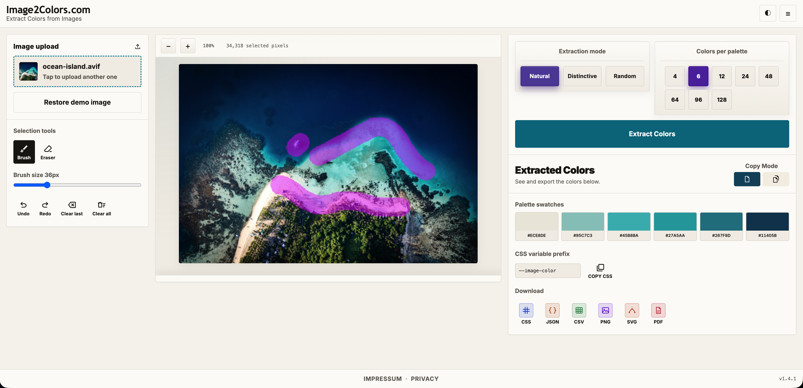
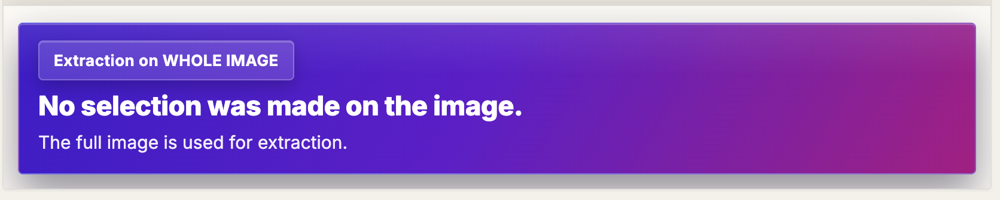
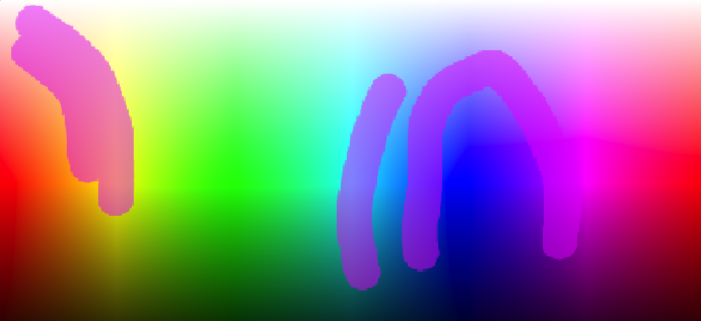
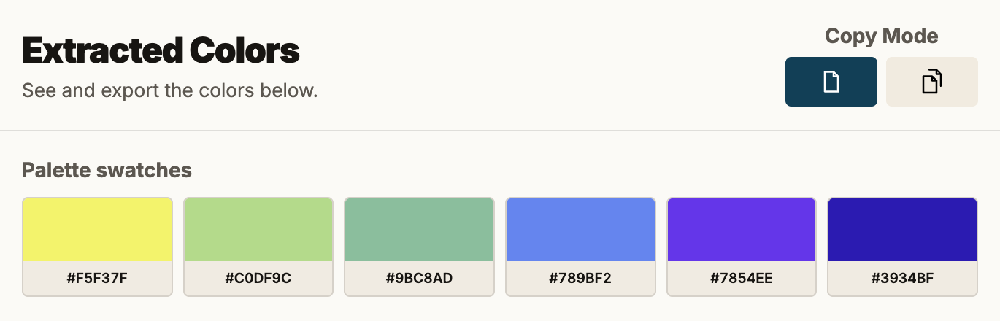
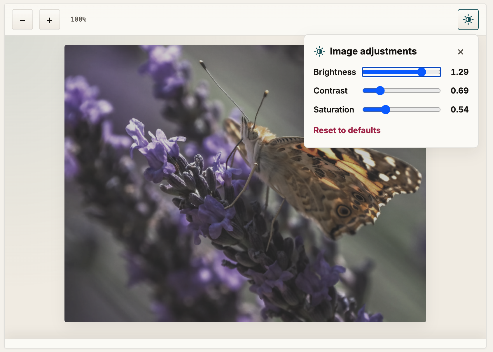
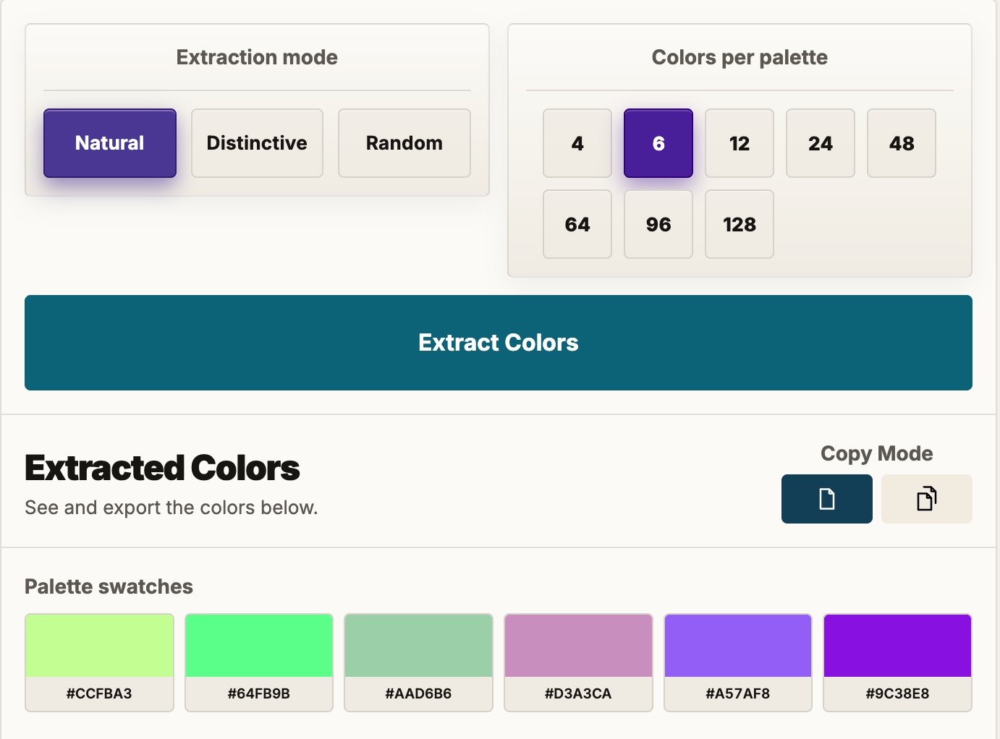
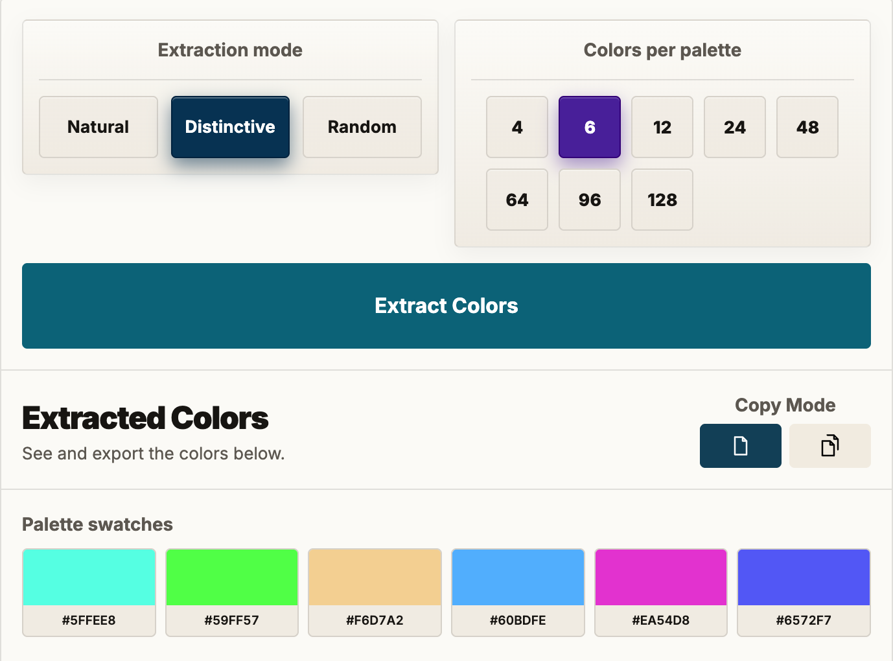
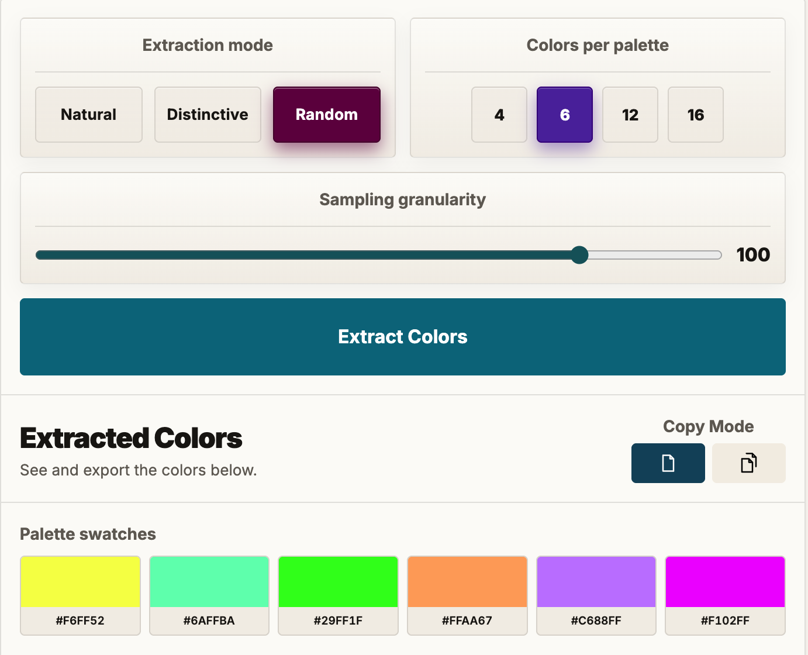
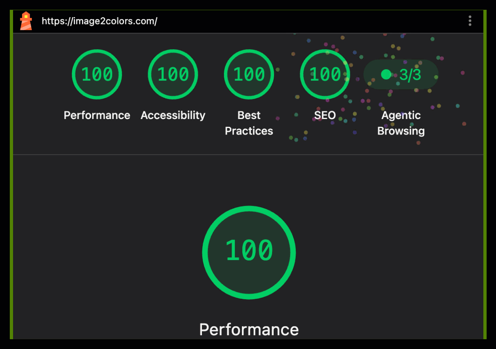

# Image2Colors.com Community Guide

> v1.7.2, last updated 2026-08-05, ~10AM Vienna time. Curious what is happening under the hood? The technical side-stories live in [docs/new](docs/new).

Welcome, and thank you for stopping by. This page walks you through **[Image2Colors.com](https://www.image2colors.com)**, even if this is your very first visit. It only takes a few minutes.



## What Image2Colors does

**[Image2Colors.com](https://www.image2colors.com)** looks at an image and pulls the colors out of it. From there you can copy a single color or export the whole palette in the format you need.

That is where it starts, but not where it ends. The app keeps growing, and color extraction is only the first chapter.

We have more in mind. If you have an idea, a wish, or something that quietly annoyed you, we truly want to hear it. Open an issue at [github.com/nxpatterns/image2colors-community/issues/new](https://github.com/nxpatterns/image2colors-community/issues/new).

And if you know more about color than about building apps, even better. We would love to learn from you, and maybe build something together.

## How to start

There are two easy ways in. Bring your own image with the upload button , or use the demo image that already waits inside the app.

This is the demo image you begin with: a quiet ocean at dusk, violet sky melting into a pink horizon, a soft sun over layered waves. Plenty of real color to play with before you reach for a photo of your own:

<p align="center">
  
</p>

Either way, you can start playing right away: paint over the areas you care about with the brush, then click **Extract Colors**.

You do not have to mark anything. If you want the colors of the whole picture, just click **Extract Colors** and the app reads the entire image for you.

## Select the important area or areas

**[Image2Colors.com](https://www.image2colors.com)** began with a simple wish: we wanted to catch the colors of nature. And nature, it turns out, is shy. Its best colors often hide in a small corner of the frame, and reading the whole image tends to wash them out. So we gave you a way to point at what matters. A butterfly resting on a flower. A bird half-hidden in a tree. A single car in a gray street. Mark it, and you get the colors you actually came for.

<p align="center">
  
</p>

<p align="center">
  
</p>

To make that easy, you have a few tools:

-  a **brush** to paint over the pixels you want
-  an **eraser** to take pixels back out
-  **undo** and  **redo**, for when your hand slips
-  **clear last** to drop only your most recent stroke, and  **clear all** to wipe the selection and start over

If you mark nothing, the app uses the whole image. Your upload if you brought one, and the demo image if you did not.

That is why, when you press **Extract Colors** without having painted anything, a small note slides in to let you know the whole image is going into the mix, every last pixel. It is not a warning, and it is not a mistake.

<p align="center">
  
</p>

Reading the entire picture is a perfectly good way to work. We only tap you on the shoulder to say the other door is open too: paint one or more areas, and from then on only the pixels inside them, and their colors, are counted.

<p align="center">
  
</p>

<p align="center">
  
</p>

## Adjust the image before you extract

Sometimes the colors you want are all there, just a little too dark, a little too flat, or a little too washed out to read cleanly. So we gave you a gentle way to nudge the image itself, before a single color is pulled from it.

Over on the right of the canvas toolbar sits a small  adjust button. Click it and a little panel opens with three sliders:

- **Brightness**, to lift a photo out of shadow, or to pull one back that is blown out
- **Contrast**, to open up the gap between light and dark when everything sits too close together
- **Saturation**, to let the colors sing a little louder, or to calm them down toward gray

<p align="center">
  
</p>

On a wide screen the panel appears as a small popover right next to the button. On a phone or tablet it slides up from the bottom as a sheet. Either way the image stays in full view the whole time, so you can watch the colors shift as you move each slider and stop exactly where it looks right.

Here is the part that matters most: these adjustments are not just a preview. What you see is what gets read. When you press **Extract Colors**, the app pulls its colors from the adjusted image, not the original, so the palette matches the picture in front of you.

Changed your mind? A **Reset** brings every slider back to the middle and the original image straight back with it. And each time you load a new image, the sliders start fresh at neutral, so nothing quietly carries over from the picture before.

## Choose how colors should be extracted

Here is a fair question: **why three modes at all** **[Image2Colors.com](https://www.image2colors.com)?**

<p align="center">
  
</p>

Because "the colors of an image" is not one single truth. It depends on what you are looking for. So we gave you three lenses, and each one answers a different question.

**Natural** answers: **what does this image actually feel like?** It reads the whole range of light and shadow and hands the colors back in the proportion they really appear. If a photo is mostly soft greens with a little sky, that is what you get, soft greens with a little sky. This is the mode for mood boards, for painters, for anyone who wants the honest atmosphere of a scene instead of a tidied-up version of it.

<p align="center">
  
</p>

**Distinctive** answers: **what are the truly different colors in here?** It pushes the results apart on purpose and drops the near-twins, so every swatch clearly earns its place. This is the one designers tend to reach for. When you need a palette where each color is its own decision, a base, an accent, a highlight that will not quietly collapse into its neighbor, start here.

<p align="center">
  
</p>

**Random** answers: **what might I not have thought of?**

Random has one more trick, and it only appears when you choose that mode. Two things quietly change.

First, the count stays smaller. Where Natural and Distinctive happily go all the way up to 128, Random tops out at 16, so your choices become 4, 6, 12, or 16.

There is a good reason for it. Random reaches for real pixels, and if an image is almost all one color, say a sky that is blue from edge to edge, asking for 128 would only hand you 128 blues you could never tell apart. Sixteen is plenty of room to be surprised without drowning in near-twins.

<p align="center">
  
</p>

Second, a **Sampling granularity** slider slides in just under the count. Think of it as how widely Random is allowed to look across the image before it picks:

- **0** switches the grid off completely. Colors are drawn purely at random from anywhere in the picture, then simply sorted from light to dark. It is the wildest setting, the one that feels most like a lucky dip.
- **10, 20, 50, 100, 250** lay an invisible grid over the image and take one color from each cell. The higher the number, the finer the grid, and the more evenly the colors are gathered from every corner instead of crowding wherever the picture happens to be busiest.

We start you at **100**, a comfortable middle ground for most images. Nudge it down when you are hunting for happy accidents, nudge it up when you want the palette to read like a fair sweep of the whole frame. And as always with Random, reroll until something surprises you.

## Generate and review your palette

Click **Extract Colors** and watch your swatches appear in the result panel. Nothing here is set in stone. Repaint a little, switch the mode, change the count, and extract again. Most palettes get better on the second or third try, once your eye tells you what was missing. Keep going until it feels right to you, not until it looks finished on paper.

## Copy and export your result

Once your palette is on screen, there are really two things you might want: to grab a single color in a hurry, or to carry the whole set away with you. The app keeps those two apart with a small mode switch, marked by a sheet-of-paper icon.

**Single copy**  is the default, the single-sheet icon. Stay here when you just want one color. Click any swatch and its hex value jumps straight to your clipboard, with a little flash to confirm it landed.

Switch to **Multi copy** , the stacked-sheets icon, when you want to gather more than one. Now a click no longer copies. Instead it selects, so you can pick out exactly the colors you want and leave the rest behind.

<p align="center">
  
</p>

As soon as you have two or more colors selected in Multi copy, a **Show selected** button appears. Press it and the grid narrows down to just your chosen colors, sitting side by side so you can feel how they work together. Press **Show all** to bring the full palette back. Nothing is lost along the way, you are only changing what you look at.

<p align="center">
  
</p>

When it is time to leave with your colors, you have two doors, and they behave a little differently on purpose.

**Copy** is for pulling colors into your code right now. Click **COPY CSS**  and they land on your clipboard as ready-to-use CSS variables. In Single copy that is the whole palette; in Multi copy it is only the colors you selected, so you can hand-pick a small set without taking everything with you. (If you are in Multi copy and have not selected anything yet, the app will gently ask you to choose a color first.)

**Export**, on the other hand, is for saving the palette as a file, and export always takes the complete set of extracted colors, never just your selection. That is simply our default for now. If you would rather export only your selected colors, tell us; this is your tool, and the behavior is easy to change. Pick the format that fits where the colors are headed:

-  CSS, variables you can paste straight into a stylesheet
-  JSON, for code, scripts, and build tools
-  CSV, for spreadsheets, sorting, and quick sharing
-  PNG, a picture of the palette to drop into a doc or a chat
-  SVG, crisp swatches that stay sharp at any size, ready for design tools
-  PDF, a clean sheet to print or hand to a client

### The CSS prefix

One small comfort for the people who live in stylesheets. Before you copy or export CSS, you can set a **prefix** for the variable names. Whatever you type becomes the front of every variable, and the app numbers them for you in order.

Type `brand`, for example, and you get:

```css
:root {
  --brand-1: #7A9E7E;
  --brand-2: #3B5B72;
  --brand-3: #E8D8C3;
}
```

So the colors arrive already speaking your project's language, and there is nothing to rename afterward. Leave the field empty and the app falls back to a sensible default, so your CSS is never left broken. It also quietly tidies up spaces and stray characters, so whatever you type comes back out as a valid variable name.

## Use the header menu when you need help

Everything you need to find your way sits up in the header:

- a theme toggle (the **◐** button), so you can work in light or dark, whichever is kinder to your eyes. Dark mode got a fresh pass in this release: surfaces, selection chips, the upload zone, and a few small controls sit a little cleaner now, without the old rainbow of selected colors fighting for attention
- a hamburger menu (**☰**) that opens onto:
  -  Info, a quick guide when you want a reminder
  -  a feedback dialog, for when you want to reach us directly

The feedback dialog can quietly attach a little diagnostic info and send it along by email. It is a small thing, but it lets us chase down the bugs that only ever show up on one particular device, the ones that are almost impossible to describe in words.

## Ideas, feedback, and a very small community

Got an idea, or something you wish the app could do? Open a new issue on GitHub: [github.com/nxpatterns/image2colors-community/issues/new](https://github.com/nxpatterns/image2colors-community/issues/new).

Prefer to reach us from inside the app? Click the hamburger menu (**☰**) in the top right and choose **Feedback**. That feedback matters more than you might think. We cannot possibly own every device out there, and this is a hobby project, not a company. I am not about to spend thousands of euros on professional cross-browser, cross-device, cross-operating-system testing tools. We solve our problems ourselves, and together, and I am here with advice and hands-on help whenever something breaks.

And nothing gets sent behind your back. When you click **Send via Email**, your own email client opens first (as long as you have one, and you almost always do). You can read the message over, edit it, cut or add whatever you like, and only then send it.

Every message you send makes the app a little kinder to the next person who loves color as much as you do. And who knows, that person might one day be here helping us build it.

**[Image2Colors.com](https://www.image2colors.com)**


