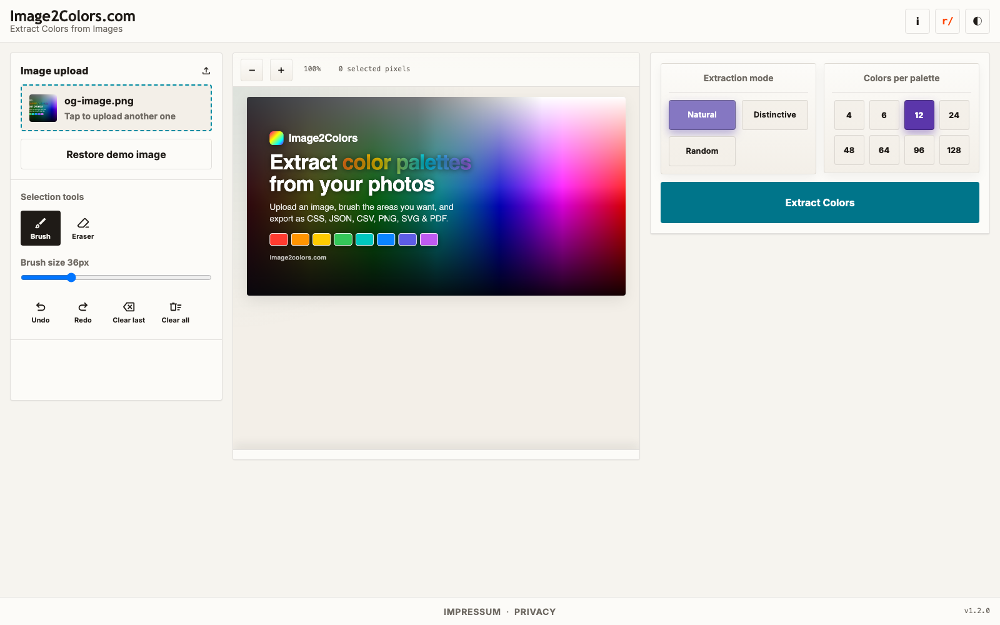
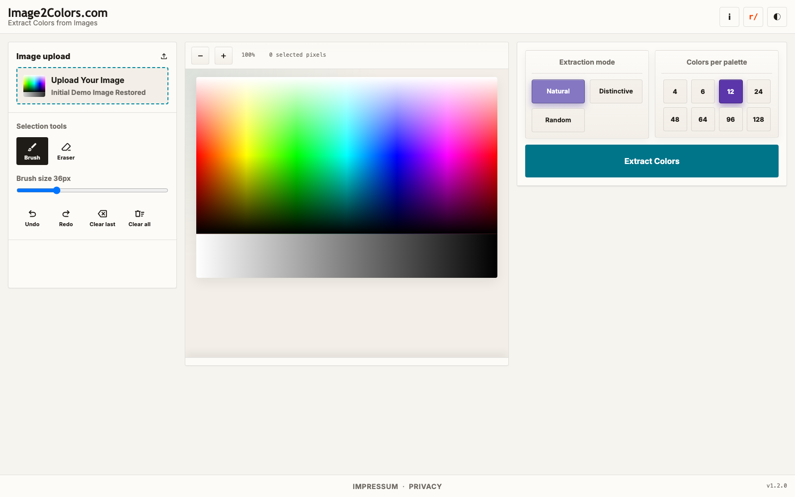

# HowTo 001: Upload an Image
This guide shows how to load an image into Image2Colors.

## What you can do
- Upload your own image file
- Drag and drop an image
- Go back to the demo image

## Step-by-step
1. Open the app.
2. On the left side, find **Image upload**.
3. Click **Tap to upload** and choose an image file from your computer.
4. Wait one moment until the preview updates.
5. If you want the built-in sample again, click **Restore demo image**.

## What you should see
- Your uploaded image appears in the canvas.
- The small preview in the upload box shows your file.
- After upload, the **Restore demo image** button is visible.

## Screenshots

## Common mistakes
- **Nothing happens after file pick**: Check if the file is an image (`.png`, `.jpg`, `.webp`, ...).
- **Wrong image loaded**: Upload again, then confirm the preview text changed.
- **Need a quick reset**: Use **Restore demo image**.