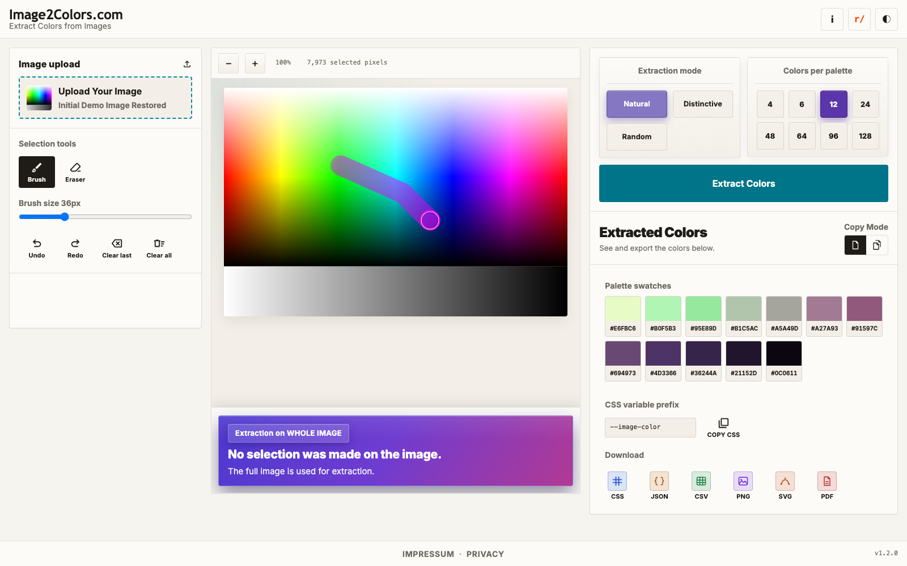

# HowTo 002: Use the Brush Tools
This guide shows how to select parts of an image before extracting colors.

## Why this matters
If you brush only one area (for example, a shirt or sky), your palette focuses on that area.

## Tools you have
- **Brush**: adds pixels to selection
- **Eraser**: removes pixels from selection
- **Brush size** slider: bigger or smaller stroke
- **Undo** / **Redo**
- **Clear last**
- **Clear all**

## Step-by-step
1. Upload an image or use the demo image.
2. Keep **Brush** active.
3. Paint over the area you care about.
4. If you selected too much, switch to **Eraser** and remove parts.
5. Use **Undo/Redo** when needed.
6. Click **Extract Colors**.

## What you should see
- A visible painted mask on the canvas.
- After extraction, the right panel shows palette swatches from your selected area.

## Screenshot

## Common mistakes
- **I cannot paint**: Make sure an image is loaded first.
- **Selection is too rough**: Reduce brush size.
- **I want to restart selection**: Click **Clear all**.