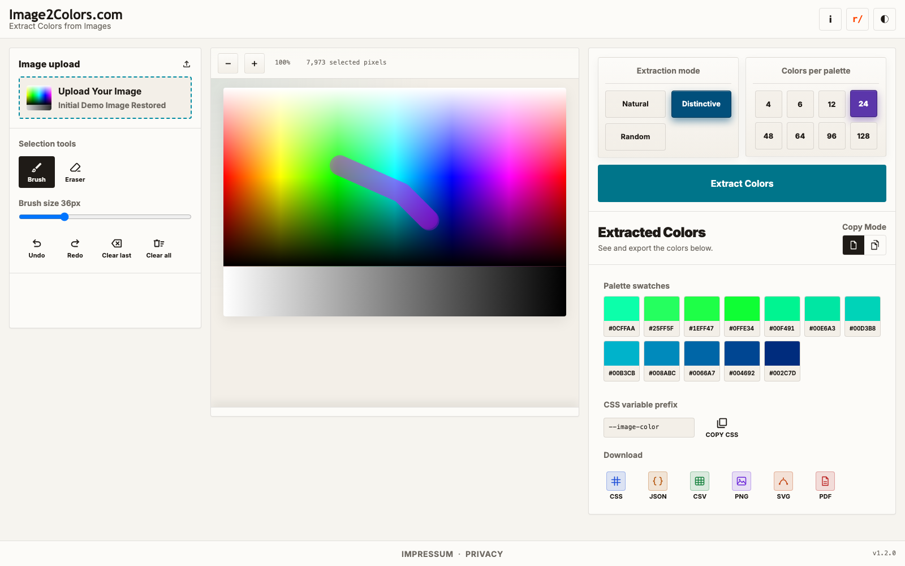

# HowTo 003: Understand Extraction Modes
This guide explains how mode and color count change your result.

## Extraction modes
- **Natural**: balanced, realistic colors from the image
- **Distinctive**: stronger, more separated colors
- **Random**: varied picks for experimentation

## Colors per palette
You can choose how many colors to generate:
- 4, 6, 12, 24, 48, 64, 96, or 128

## Step-by-step
1. Load an image.
2. Pick one mode: **Natural**, **Distinctive**, or **Random**.
3. Pick a color count (for example 12 or 24).
4. Click **Extract Colors**.
5. Compare the results. Change mode/count and extract again.

## What you should see
- Different modes can produce different palette character.
- Higher color count gives more swatches.

## Screenshot

## Tip
Start with **Natural + 12**. Then test **Distinctive + 24** if you need bolder separation.