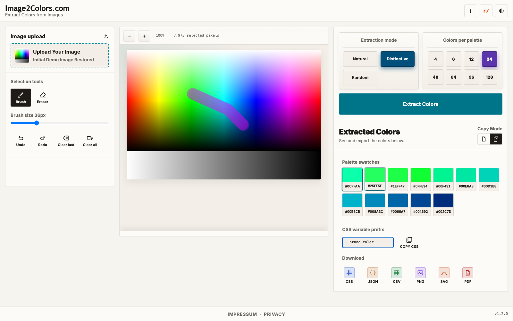

# HowTo 005: Copy and Export Your Colors
This guide shows how to copy and download your palette after extraction.

## Copy modes
- **Single** mode: click one swatch to copy one hex color
- **Multi** mode: select multiple swatches, then copy CSS for selected colors

## CSS variable prefix
Use **CSS variable prefix** to define variable names in CSS export.

Example:
- Prefix input: `--brand-color`
- Output: `--brand-color-1`, `--brand-color-2`, ...

## Export options
You can download in these formats:
- CSS
- JSON
- CSV
- PNG
- SVG
- PDF

## Step-by-step
1. Click **Extract Colors** first.
2. Choose **Single** or **Multi** copy mode.
3. In Multi mode, click swatches you want to include.
4. Set your CSS prefix (optional).
5. Use **COPY CSS** or click a download format button.

## Screenshots

## Common mistakes
- **COPY CSS does nothing in Multi mode**: Select at least one swatch first.
- **Wrong CSS variable names**: Check the prefix input and try copy/download again.